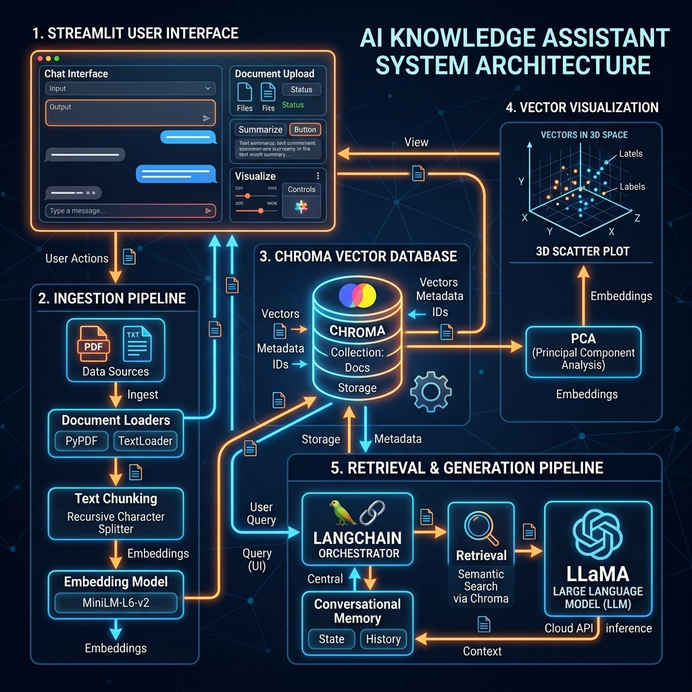
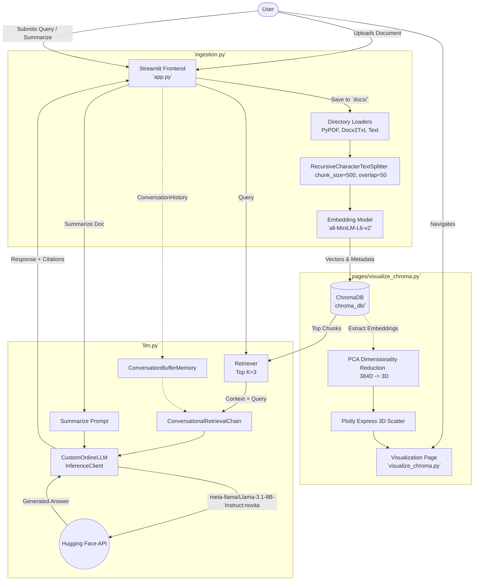
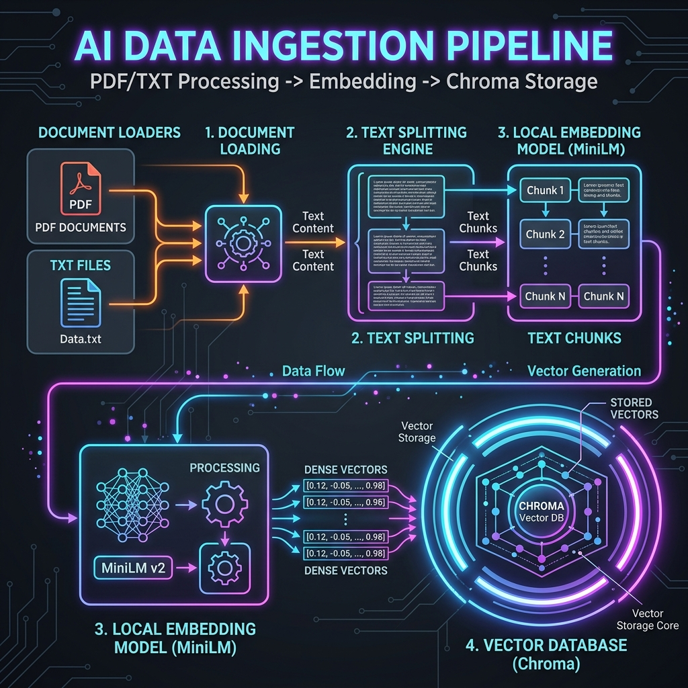
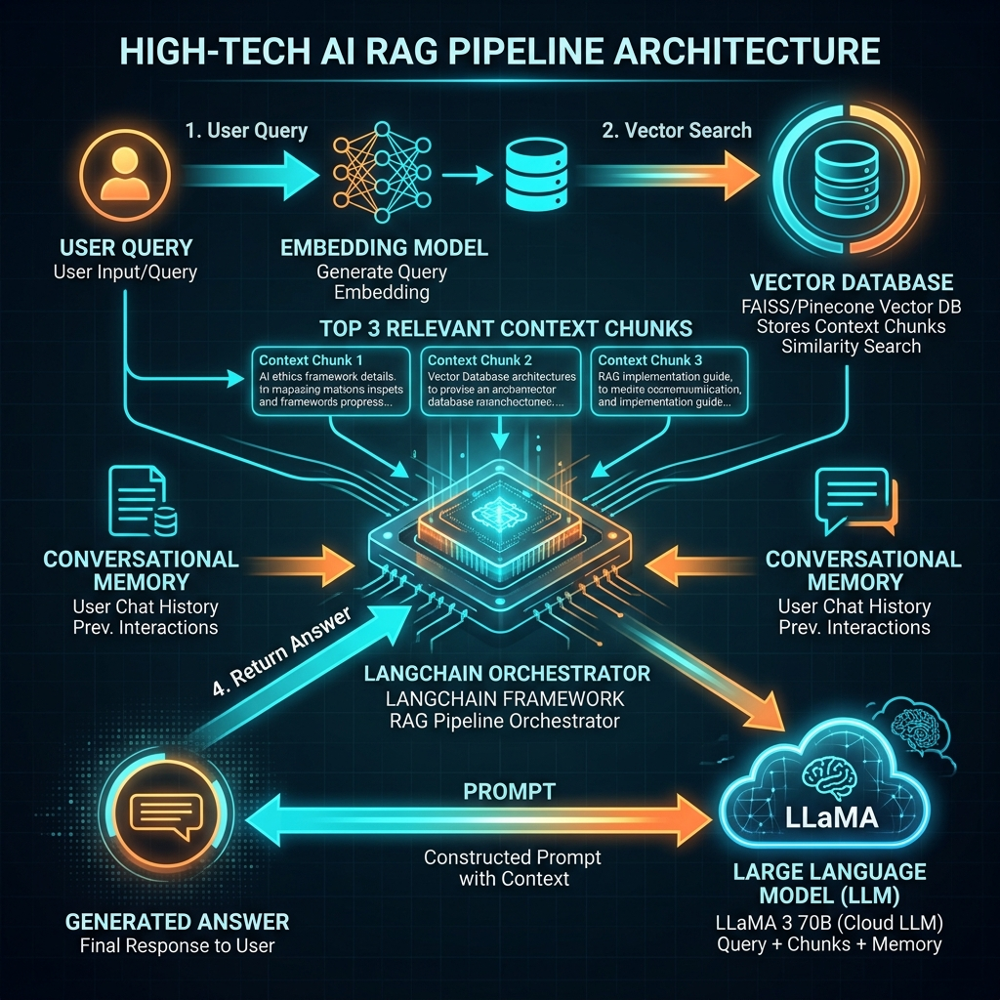
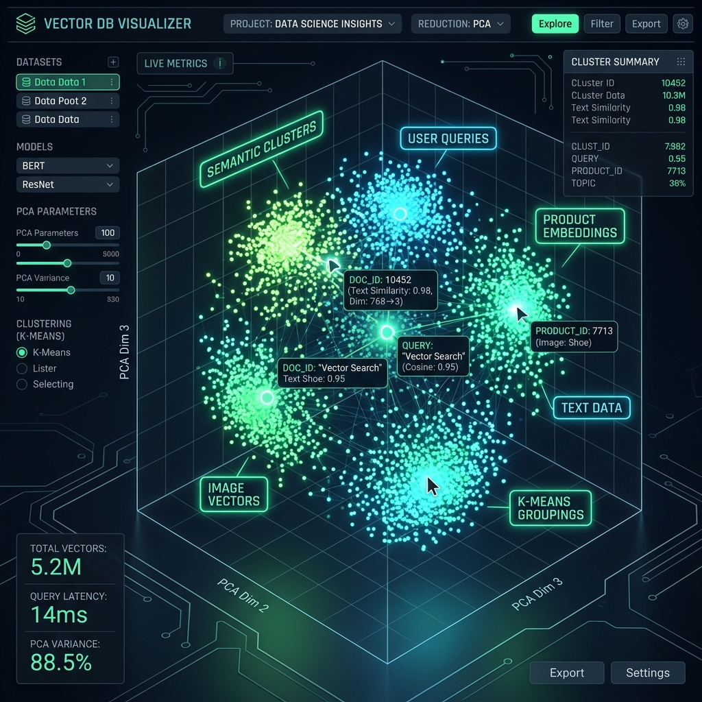

# System Architecture & Detailed Design

This document details the system design, core components, and architecture of the **AI-Powered Personal Knowledge Assistant**. The system uses a standard **Retrieval-Augmented Generation (RAG)** architecture to provide intelligent, context-aware responses based on user-provided documents, while preserving conversation history and enabling direct 3D vector visualizations.

## High-Level Architecture Diagram

## Workflow & Core Components

The system is constructed with a modular, decoupled architecture, primarily utilizing **Streamlit** for the frontend, **LangChain** for orchestration, **ChromaDB** for vector storage, and **Hugging Face** for embedding and inference.

### 1. User Interface & State Management (`app.py`)
- **Framework**: Streamlit
- **Functionality**:
  - **State Management**: Persists chat history `messages`, LangChain's `ConversationBufferMemory`, and the active `ConversationalRetrievalChain` within `st.session_state`.
  - **Document Ingestion**: Intercepts user uploads, saves raw files to the `docs/` folder, and triggers the `run_ingestion` pipeline.
  - **Summarization Utility**: Allows users to select an uploaded document, loads the full text, and bypasses retrieval to request a high-level summary directly from the LLM.
  - **Chat Interface**: Renders the conversation iteratively, invoking the LLM chain and displaying explicit source document citations dynamically parsed from the chunk metadata.

### 2. Ingestion & Embedding Pipeline (`ingestion.py`)

- **Document Loading**: Uses `langchain_community.document_loaders.DirectoryLoader` combined with specialized extractors (`TextLoader`, `PyPDFLoader`, `Docx2txtLoader`) to read raw text from different formats.
- **Chunking Strategy**: Employs `RecursiveCharacterTextSplitter` using a `chunk_size` of 500 characters and a `chunk_overlap` of 50 characters. This maintains the contextual thread between adjacent blocks while safely remaining under context limits.
- **Embeddings**: Uses `langchain_huggingface.HuggingFaceEmbeddings` with the lightweight, fast `all-MiniLM-L6-v2` model, computing a 384-dimensional dense vector for each chunk locally.
- **Storage**: Inserts chunks into a persistent `Chroma` database mapped to the `chroma_db/` directory. Uses deterministic ID generation (`{source}_chunk_{i}`) to prevent duplication when re-ingesting documents across sessions.

### 3. Retrieval & Language Modeling (`llm.py`)

- **Custom LLM Wrapper**: Defines `CustomOnlineLLM`, inheriting from LangChain's `LLM` class. It uses the `huggingface_hub.InferenceClient` to interface securely and reliably with remote Hugging Face API models, abstracting HTTP complexities.
- **Target Model**: `meta-llama/Llama-3.1-8B-Instruct:novita`. Selected for its robust reasoning and instruction-following capabilities.
- **Conversational Chain**: Instantiates a `ConversationalRetrievalChain` that integrates:
  - **Vector Retriever**: Fetches the top `k=3` most semantically relevant chunks from Chroma.
  - **Memory**: Injects the `ConversationBufferMemory` context to maintain fluid follow-up dialogue.
  - **Prompting**: Enforces a strict grounding protocol (`Answer the question relying ONLY on the Context provided below...`), minimizing hallucinations.

### 4. Vector Visualization Engine (`pages/visualize_chroma.py`)

- **Purpose**: Provides deep observability into the semantic clustering mechanism within the vector database.
- **Data Extraction**: Pulls raw arrays, associated metadata, and IDs directly from the `Chroma._collection`.
- **Dimensionality Reduction**: Implements `sklearn.decomposition.PCA` to reduce the high-dimensional vectors (e.g., 384 dimensions) down to 3 Principal Components (3D space).
- **Interactive Plotting**: Utilizes `plotly.express.scatter_3d` to render a manipulable 3D plot. Points are color-coded by their source document, proving visually how chunk embeddings from the same or similar documents cluster together in semantic space.

## Persistent Storage Configuration
- **`docs/` Directory**: A temporary/persistent staging area for user-uploaded text and documents.
- **`chroma_db/` Directory**: The persistent local vector database storage generated by ChromaDB, preventing the need to recalculate embeddings on subsequent server launches.
